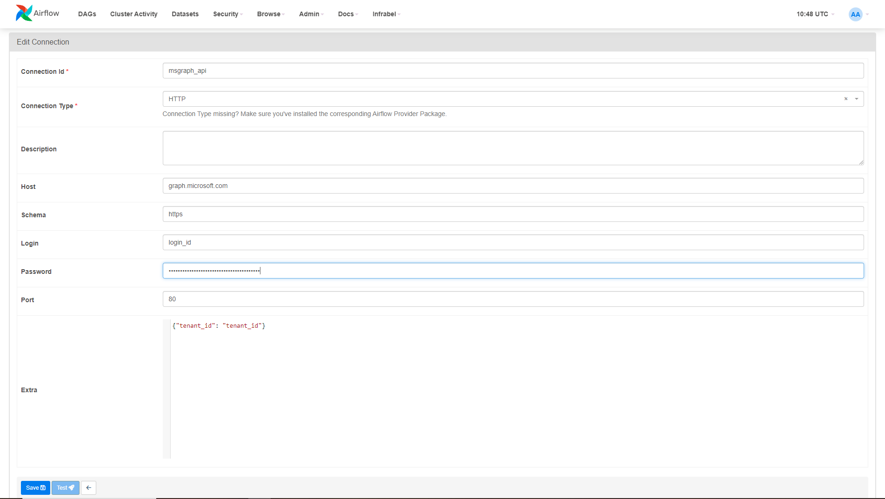

<p align="center"><h1 class="center-title">Airflow Provider Microsoft Graph API</h1></p>

<p align="center">
    
    
</p>

Airflow provider package for Microsoft Graph API.

How to develop a Providers package correctly: https://airflow.apache.org/docs/apache-airflow-providers/
Astronomer Providers registry: https://registry.astronomer.io/providers
Making async API calls with Airflow: https://betterprogramming.pub/making-async-api-calls-with-airflow-dynamic-task-mapping-d0cbd3066ebb


## Documentation

### Configration



### Examples

Getting users:

```python
from airflow.providers.microsoft.msgraph.operators.msgraph import MSGraphSDKAsyncOperator

users_task = MSGraphSDKAsyncOperator(
        task_id="users_delta",
        conn_id="msgraph_api",
        expression="users.get()",
    )
```

Getting users delta:

```python
from airflow.providers.microsoft.msgraph.operators.msgraph import MSGraphSDKAsyncOperator

users_delta_task = MSGraphSDKAsyncOperator(
        task_id="users_delta",
        conn_id="msgraph_api",
        expression="users.delta.get()",
    )
```

Getting a site from it's relative path and then get pages related to that site:

```python
from airflow.providers.microsoft.msgraph.operators.msgraph import MSGraphSDKAsyncOperator

site_task = MSGraphSDKAsyncOperator(
    task_id="wgive_site",
    conn_id="msgraph_api",
    expression="sites.by_site_id('850v1v.sharepoint.com:/sites/wgive').get()",
)

site_pages_task = MSGraphSDKAsyncOperator(
    task_id="news_site_pages",
    conn_id="msgraph_api",
    expression=(
        "sites.by_site_id('%s').pages.get()"
        % "{{ ti.xcom_pull(task_ids='wgive_site')['id'] }}"
    ),
)

site_task >> site_pages_task
```
